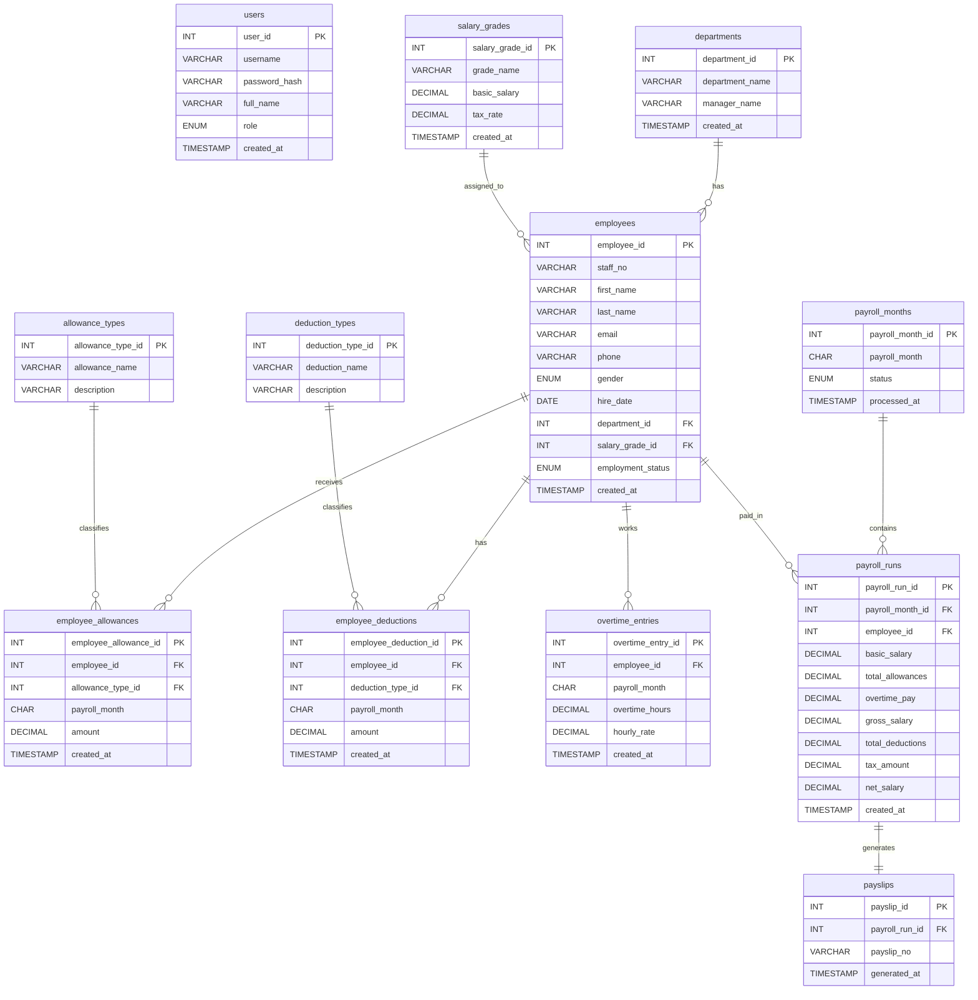

# Payroll Management Database ERD

This Entity Relationship Diagram shows the main tables and relationships in the payroll management database system.



## Relationship Explanation

- One department can have many employees.
- One salary grade can be assigned to many employees.
- One employee can have many allowance entries.
- One allowance type can be used in many employee allowance entries.
- One employee can have many deduction entries.
- One deduction type can be used in many employee deduction entries.
- One employee can have many overtime entries.
- One payroll month can contain many payroll runs.
- One employee can have many payroll runs across different months.
- One payroll run generates one payslip.

## Payroll Calculation

```text
gross_salary = basic_salary + total_allowances + overtime_pay

tax_amount = gross_salary * tax_rate / 100

net_salary = gross_salary - total_deductions - tax_amount
```

